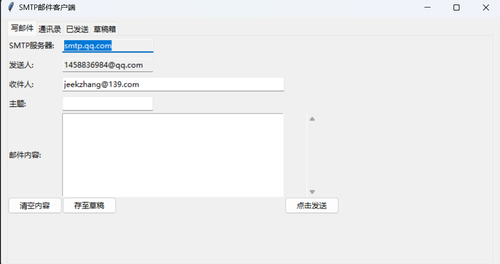

# SMTP Client
——基于socket和gui(tk)实现的SMTP邮件客户端

### 代码结构

```bash
SMTP-Client:
│  certificate.pem          //证书文件
│  privkey.pem				//私钥文件
│  contact.txt              //联系人数据库
│  draft.txt				//草稿箱数据库
│  sended.txt				//发件箱数据库
│  smtp.py                  //主体函数
```


### 功能介绍

含四个子功能：写邮件、通讯录、已发送、草稿箱




### 复现

运行时请将fromAddress替换为自己的邮箱并添加开启SMTP服务时对应的授权码，如有疑问可联系我"jeekzhang@139.com"或提交issue


### 亮点功能

- 本地数据库：

  分别使用三个txt文件来存储数据，再通过正则表达式来读取

- TSL加密：

  通过ssl.wrap_socket函数实现，传入私钥文件'./privkey.pem'和证书文件'./certificate.pem'

  ```python
  ssl.wrap_socket(
              clientSocket, keyfile='./privkey.pem', certfile='./certificate.pem', server_side=False)
  ```

  文件的生成可参考：https://blog.csdn.net/sirobot/article/details/115765132

